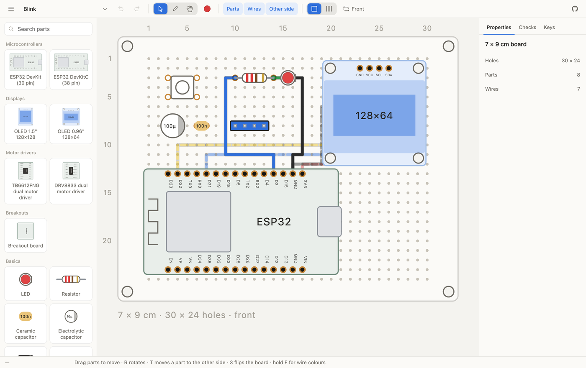

# Perfbored

A simple perfboard editor that runs in the browser. You drop parts onto a 2.54 mm hole
grid, run wires between them on either side of the board, and it tells you what is actually
connected, so you know before burning your fingers with a soldering iron. Mostly vibe-coded
for myself, but seemed pretty good for its use case so decided to share. 🫶

**[Open the editor →](https://sirpryderi.github.io/perfbored/)**



It is not a PCB tool, and it's not meant to be.

## What it does

- **Parts snap to the grid.** Holes are numbered the way you count them on the real board —
  `C5R3` — so you can find the spot with a finger.
- **Both sides.** Parts and wires live on the front or the back, the far side shows through
  as a ghost, and flipping the board mirrors everything correctly so it reads the right way
  round from either side.
- **It checks the wiring.** A wire is one conductor along its whole path, it connects to any
  pin whose hole it crosses, and two wires touching end-to-middle is a junction while two
  merely crossing are insulated, the rules model hand soldering, not PCB traces.
- **Boards live in your browser.** Nothing is uploaded, there is no account, and ⌘S writes
  the board out as JSON you can keep or pass around.

## Running it locally

You will need [Bun](https://bun.sh).

```bash
bun install
bun run dev
```

Pushing to `main` builds and publishes to GitHub Pages through
[`.github/workflows/deploy.yml`](.github/workflows/deploy.yml). If you fork it, set
**Settings → Pages → Source** to **GitHub Actions** once and it will look after itself.

## Contributions

Very welcome, and adding a part is the easy one, it is a single file in
[`src/library/parts/`](src/library/parts/) plus a line in
[`src/library/index.ts`](src/library/index.ts). A part declares where its pins sit in hole
units, its outline in millimetres, and how to draw it as SVG; there is no registry to update
and no build step to teach about it. If the thing in your parts bin is missing, that is a
short afternoon.

Being a vibe coded app, vibe coded additions are accepted, or I'll be a hypocrite.

The one rule worth knowing before you start: geometry is always stored as seen from the
front, and a part on the back is mirrored so it reads correctly when you flip the board.
[CLAUDE.md](CLAUDE.md) goes through that and the rest of the internals in more detail.

## Licence

[MIT](LICENSE). Do whatever you like with it.
